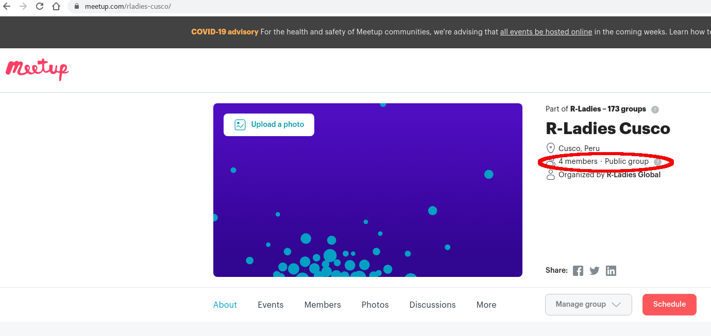
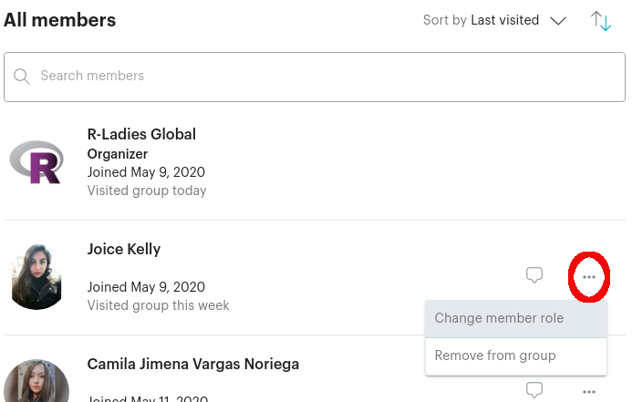
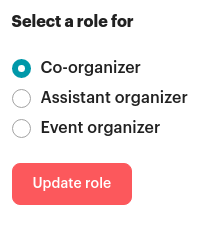
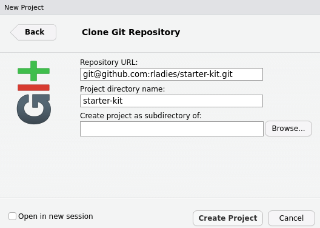

## Goal

The goal of this activity is to manage chapters on the meetup.com
platform. This is a demanding role and the person in charge needs to be
able to commit a few hours weekly. Ideally, this will become a team of
at least 2 people, to split the workload and guarantee requests are
addressed any time of the year.

## What to do

-   Monitor the organisers slack channel **\#new\_chapters**.

-   If there is a request for activation of a new chapter, activate a
    new meetup page for the chapter following instructions in [Appendix A](#appendix-a-new-meetupcom-page-template).

-   Once the chapter is activated on meetup.com, let the organiser know
    on \#new\_chapters.\
    Example message: *Hi! Your chapter is now active. I'll DM you
    instructions for the next steps.*

-   Start a direct message with the organisers to share basic
    information. See [Appendix B](#appendix-b-message-template) for a message template (make sure
    you adapt the template with the correct name of the chapter).

-   The organiser is expected to join the meetup group, so that you can
    make her a co-organiser. In order to do that:

    -   Go to the meetup page for the chapter

    -   Then click on 'N members' (see red oval shape in the screenshot
        below)



-   In the list, locate the member you want to make a co-organiser click
    the three dots next to the name
    


-   Then click 'Change member role'

-   Select 'co-organiser' and click on 'Update role'




-   If any **meetup-related problems** arise, please liaise with
    Marie-Lou Gauthier (`marielou@meetup.com`), the R-Ladies dedicated
    Account Manager for Meetup Pro. Marie-Lou is proactive and
    passionate and she'll be a great resource for you to share
    feedback, ask questions, and strategize around any
    challenges/opportunities.\
    Typical problems I have experienced:

    -   The name of the city is not available in the meetup database
        which prevents me from creating the meetup page. Sometimes,
        you have to check spelling in different languages. If that
        does not work, Marie-Lou will be able to add the city to the
        database manually.

    -   If you are trying to **re-activate a chapter that was previously
        retired**, meetup won't allow you to use the standard string
        rladies-city1-city2. In this case you should contact
        Marie-Lou. If you have already created a new page, please ask
        Marie-Lou to change the custom address to the standard
        rladies-city1-city2.

-   Periodically **monitor content on meetup**:

    -   Things to check:

        -   Every chapter has at least one co-organiser (if there are no
            co-organisers, let the leadership know as this chapter
            will need to retire)

        -   No cis-men should be made co-organisers/assistant/etc

        -   Content needs to be consistent across chapters and to make
            sure people do not abuse the R-Ladies org. For instance,
            please check that chapters are not run by companies
            under the hood.

    -   If there are any problems, please contact the organiser to ask
        for clarification. If the situation cannot be sorted in a
        friendly way, then report to the leadership team
        (`leadership@rladies.org`) and we will help you find a way
        forward.

-   **Delete chapter pages if necessary**. A chapter page on meetup will
    need to be deleted if:

    -   The chapter is inactive for a long time. Saranjeet tracks
        chapter activity and will periodically provide you with the
        list of inactive chapters to retire.

    -   The chapter is not following R-Ladies mission and guidelines
        (e.g. is run by a company, or charges for events, etc).

-   **Keep the record on GitHub always up-to-date**
    ([https://github.com/rladies/starter-kit/blob/master/Current-Chapters.csv](https://github.com/rladies/starter-kit/blob/master/Current-Chapters.csv)).
    This means adding new chapters to the list, or changes their
    status from Prospective to Active or from Active to Retired. See
    [Appendix C](#appendix-c-update-current_chapterscsv-on-github) for more details.

### Appendix A: New meetup.com page template

#### Step1: What\'s your new Meetup Group\'s hometown?

City, Country

#### Step 2: What will your Meetup be about?

Category: Technology

#### Step 3: What will your Meetup\'s name be?

Name: R-Ladies City1 City2 \-\--\By default meetup will create a page
with this URL `https://www.meetup.com/R-Ladies-City1-City2/`.
This URL will be changed in one of the steps below.

#### Step 4: Describe who should join, and what your Meetup will do.

```markdown
This is a local chapter of R-Ladies Global
([https://www.rladies.org](https://www.rladies.org)), an
organisation that promotes gender diversity in the R community
worldwide. We meetup in person or virtually to learn about the R
programming language, algorithms and advanced tools.

R-Ladies welcomes members of all R proficiency levels, whether you\'re a
new or aspiring R user, or an experienced R programmer interested in
mentoring, networking & expert upskilling. Our community is designed to
develop our members\' R skills & knowledge through social, collaborative
learning & sharing. Supporting minority identity access to STEM skills &
careers, the Free Software Movement, and contributing to the global R
community!

We are pro-actively inclusive of queer, trans, and all minority
identities, with additional sensitivity to intersectional identities.
Our priority is to provide a safe community space for anyone identifying
as a minority gender who is interested in working with R. As a founding
principle, there is no cost or charge to participate in any of our
R-Ladies communities around the world. You can access our presentations,
R scripts, and Projects on our Github account
([https://github.com/rladies](https://github.com/rladies))
and follow us on Twitter
([https://twitter.com/RLadiesGlobal](https://twitter.com/RLadiesGlobal))
to stay up to date about R-Ladies news!

Make sure you read and comply with our [code of conduct](https://rladies.org/code-of-conduct/)
and [community guidelines](/mission/#r-ladies-rules--guidelines).

Please note that by taking part in an R-Ladies event you grant the
community organizers full rights to use the images resulting from the
photography/video filming/media, and any reproductions or adaptations of
the images for publicity, fundraising or other purposes to help achieve
the community's aims. This might include (but is not limited to), the
right to use them in their printed and online publicity, social media,
press releases and funding applications. If you do not wish to be
recorded in these media please inform a community organizer.
```

#### Step 5: Agree with the Meetup's terms and conditions.

#### Step 6: Customise group

-   **Short bio:** R-Ladies is a world-wide organization to promote
    gender diversity in the R community
    ([https://rladies.org/](https://rladies.org/)).

-   **Welcome message:** Hello and welcome to R-Ladies!

-   **From home page click on: Manage Group -\Edit Group Settings and
    select the 'Basics' tab**

    -   **Custom member label:** R-Ladies

    -   **Custom address:** meetup.com/Urlname: rladies-city1-city2

-   Save, then go Back to group settings and **select the 'Optional
    features' tab:**

    -   Change mailing list to match urlname: rladies-city1-city2

    -   In **Mailing list**,

        -   select 'Allow all members to send messages'

        -   Your mailing list address must be unique:
            rladies-city1-city2

    -   Follow us on:

        -   Website: https://www.rladies.org

        -   Twitter: @RLadiesGlobal

### Appendix B: Message template

**Message the organiser with basic info:**

```markdown

Hi and welcome to R-Ladies!

Your chapter is set up:

-   Link: ADD MEETUP LINK

-   Email address for mailing list:**\<rladies-xxx\>**-list\@meetup.com

-   Email address for announcements:
    **\<rladies-xxx\>**-announce\@meetup.com

Things to keep in mind/to know:

-   Please visit the website and click on the button \<Join Group\>. Let
    me know when you become a member of the group, so that I can make
    you an organizer with full admin rights. The page contains some
    standard text in English, you can customise the text and add
    organisers. To do so, just click on the button \<Manage group\on
    your chapter's meetup page.

-   Ask  `email@rladies.org` to set up your chapter email address. You should use
    it to set up [all your social media accounts (twitter, instagram,
    etc)](/organization/tech/). 
    The rladies email address is your primary communication channel
    with the organisation, make sure you check this account
    frequently!

-   When there is any change to your group (create social media
    accounts, add organizers, etc) please, update the info here:
    https://github.com/rladies/starter-kit/blob/master/Current-Chapters.csv.
    This is the place where the chapter info is stored so make sure it
    is up to date.

-   If needed, ask \@hannah to create a GitHub repo for your chapter.

-   On GitHub you also find our starter-kit and official logos you can
    use on your meetup page (e.g.
    [https://github.com/rladies/starter-kit/blob/master/logo/R-LadiesGlobal\_RBG\_online\_LogoWithText.png](https://github.com/rladies/starter-kit/blob/master/logo/R-LadiesGlobal_RBG_online_LogoWithText.png))

-   Once your meetup group is established, please hold your first event
    within the next 6 months. After that, please keep your chapter
    active with at least one event every 6 months. For comparison,
    many chapters do an event every 2-3 months and some chapters do
    monthly events. If you find yourself struggling with this
    frequency, please be in touch and we'll figure something out.

-   We suggest that every time you run an event to publish it into your
    chapter meetup account, this will keep the chapter active

If you have any questions, please do not hesitate to contact us.

**Thank you for being part of the R-Ladies community!**
```

### Appendix C: Update Current\_chapters.csv on GitHub

The first time you want to change this file, you need to
clone the repository to your computer. You can do this using RStudio

1.  Create a new project, going to File - New Project - Version
    control - Git, then fill the fields as shown below
    


2.  Then click on 'Browse' and select a directory of your choice on your
    computer

3.  Click on 'Create Project'

Every time you open the starter-kit project, go to the **Git** tab and
click **'Pull'.**


4.  Load the Current-Chapters.csv

```r
df <- read.csv("Current-Chapters.csv", stringsAsFactors = FALSE)
```

5.  Check if the chapter in Talca is onboarded:

```
city <- "Talca"

idx <- grep(pattern = city, x = df$City, ignore.case = TRUE); df[idx,]
```

If the chapter is not in the list, contact the onboarding team and check with
them why the chapter was not onboarded. If the chapter if in the list,
the command above should return something like

```
Country State.Region City Meetup Twitter Email Facebook Instagram
Periscope Youtube GitHub Website Slack Organizers Status

67 Chile Talca Alejandra Andrea Tapia Silva Prospective
```

6.  You will need to fill in the fields Meetup and Status as shown below

```r
df$Meetup[idx] <- "https://www.meetup.com/rladies-talca/"

df$Status[idx] <- "Active"
```

7.  Check the dataframe was updated correctly. If so, overwrite the csv:

```r
write.csv(df, "Current-Chapters.csv", row.names = FALSE)
```

8.  Lastly, commit and push your changes in the Git tab. And then, check
    on Github the changes were pushed.
    

9. Contact Mari-Lou if needed (see earlier).
